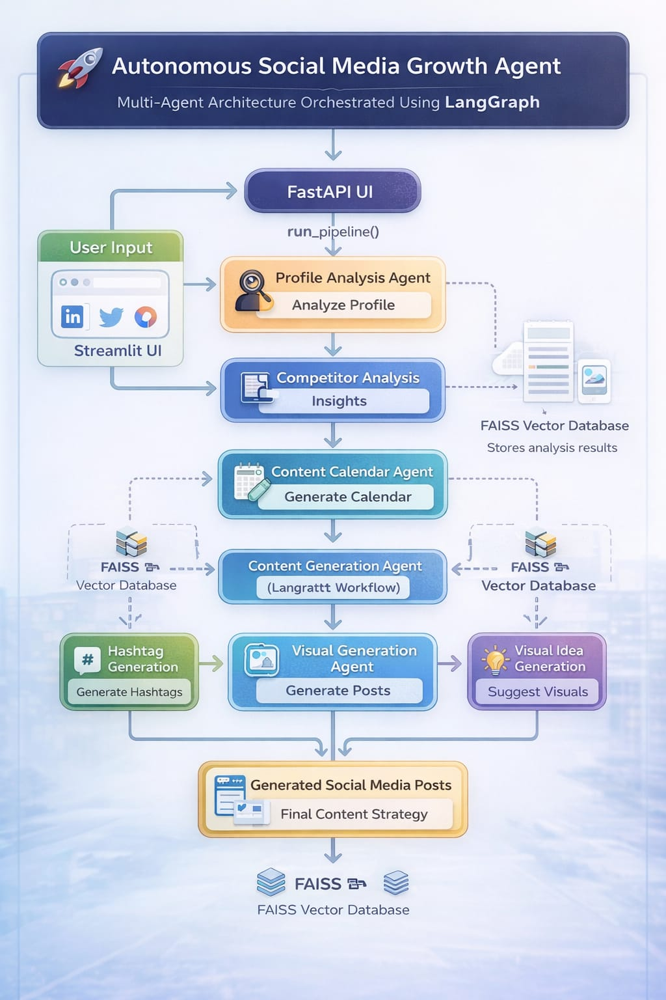
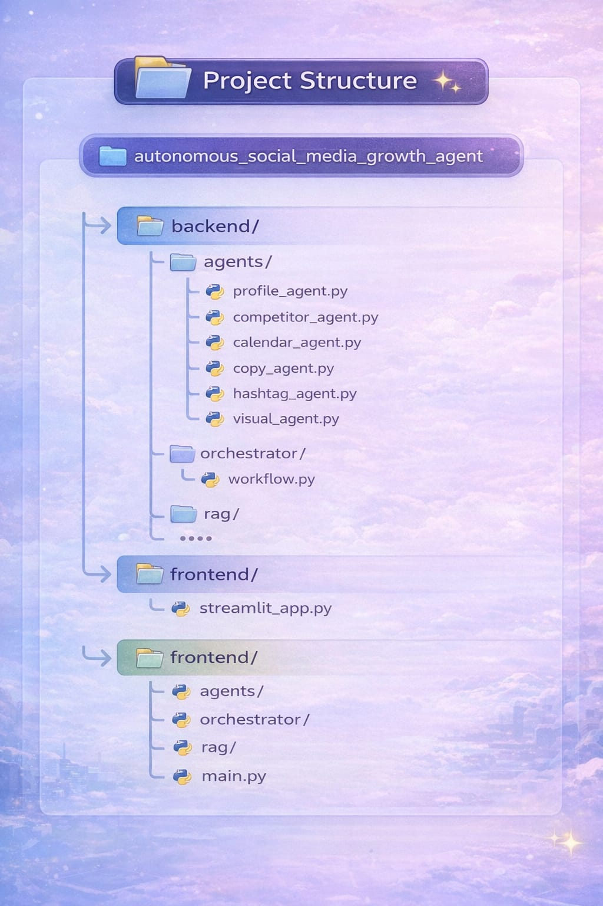

# 🚀 Autonomous Social Media Growth Agent

AI-powered **multi-agent system** that analyzes social media profiles, studies competitors, generates a content strategy, and creates ready-to-post social media content automatically.

Built using **LangGraph, FastAPI, Streamlit, and RAG (FAISS Vector Database)**.

---

# 🏗️ System Architecture

The system uses a **multi-agent workflow pipeline** where each agent performs a specific task.

Workflow:

User Input (Streamlit UI)  
↓  
Profile Analysis Agent  
↓  
Competitor Analysis Agent  
↓  
Content Calendar Agent  
↓  
Content Generation Agent  
↓  
Hashtag Agent + Visual Agent  
↓  
Generated Social Media Posts

---

# 📂 Project Structure

Main folders:

backend/
- agents → AI agents (profile, competitor, content generation)
- orchestrator → LangGraph workflow
- rag → vector database and retrieval system

frontend/
- streamlit_app.py → user interface

---

# ⚙️ Tech Stack

- Python
- LangGraph
- FastAPI
- Streamlit
- FAISS
- Sentence Transformers

---

# 🚀 Run Locally

Clone repository

git clone https://github.com/Snehily21/autonomous_social_media_growth_agent.git⁠�

Install dependencies
pip install -r requirements.txt

Run application
streamlit run frontend/streamlit_app.py

---

# ✨ Features

- Profile Analysis
- Competitor Insights
- AI Content Calendar
- Social Media Post Generation
- Hashtag Generation
- Visual Content Suggestions

---

# 👨‍💻 Author

**Snehil Yadav**

GitHub  
https://github.com/Snehily21

---

# DOCKER RUN

**RUN COMMAND IN TERMINAL

 docker-compose up --build
